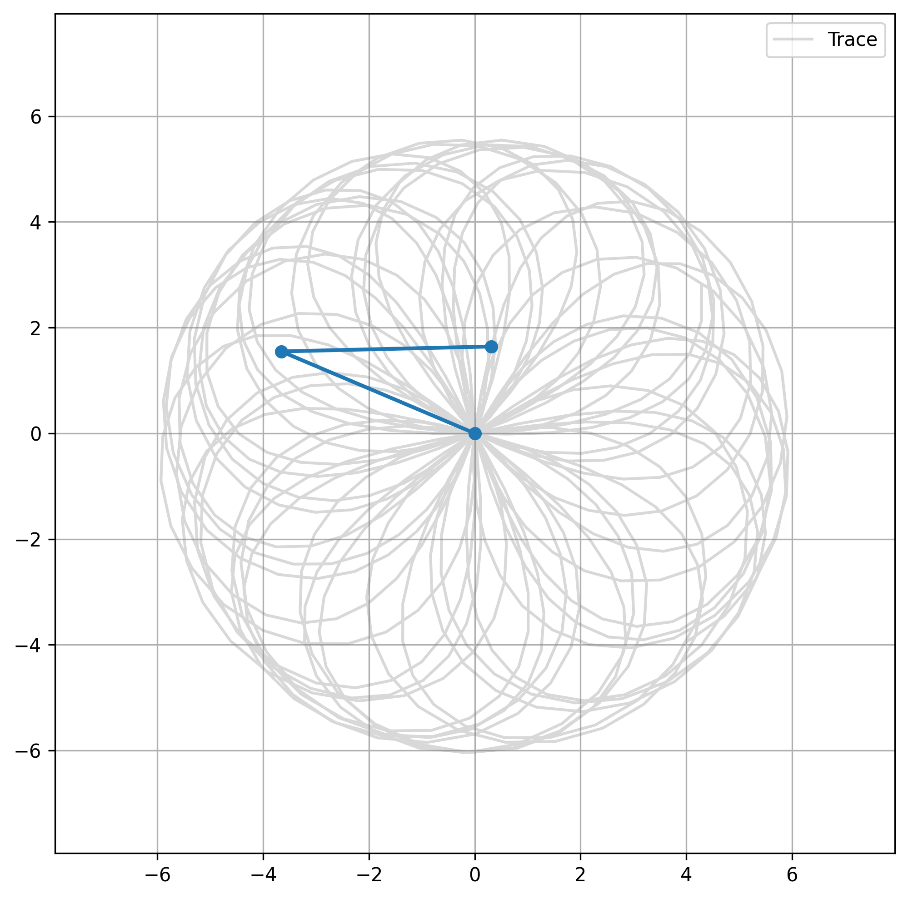

# 🌌 Lagrangian & Hamiltonian Mechanics Explorer

An interactive, multi-level Streamlit application designed to bridge analytical mechanics, variational calculus, and computational structural analysis. From foundational principles of least action to finite element stress mapping, this app provides hands-on derivations, real-time parameter exploration, and publication-ready visualizations.


---

## 📚 Learning Path

The application is organized into three progressive levels, each building mathematical intuition and computational fluency.

### 🔹 Level 1: Foundations of Variational Mechanics
| File | Title | Focus |
|------|-------|-------|
| `pages/1_newton.py` | Newton's Laws | Force-based dynamics, constraint handling, and coordinate transformations. |
| `pages/2_least_action.py` | Principle of Least Action | Stationary action, path integrals, and the bridge between physics and optimization. |
| `pages/3_euler_lagrange.py` | Euler-Lagrange Equations | **Derivation I:** Foundational variational calculus for conservative systems. |

### 🔹 Level 2: Applied Dynamics & Celestial Mechanics
| File | Title | Focus |
|------|-------|-------|
| `pages/6_statics.py` | Rod in a Bowl | Equilibrium in curved constraints and virtual work principles. |
| `pages/8_single_pendulum.py` | Single Pendulum | Energy conservation, small-angle limits, and introductory phase space. |
| `pages/9_double_pendulum.py` | Double Pendulum | Coupled nonlinear dynamics, chaos, and trajectory sensitivity. |
| `pages/10_euler_lagrange2.py` | Euler-Lagrange (Advanced) | **Derivation II:** Rigorous generalized-coordinate treatment with holonomic constraints & non-potential forces. |
| `pages/11_lagrange_points.py` | Lagrange Points | Effective potential landscapes and equilibrium in the restricted three-body problem. |

### 🔹 Level 3: Computational Mechanics & Structural Analysis
| File | Title | Focus |
|------|-------|-------|
| `pages/12_state_space_mdof.py` | State Space MDOF | Multi-degree-of-freedom systems, modal decomposition, and matrix exponentiation. |
| `pages/12A_networkx_explained.py` | NetworkX Explained | Graph-theoretic modeling for structural connectivity and automated DOF mapping. |
| `pages/13_hamiltonian_phase_space.py` | Hamiltonian Phase Space | Canonical coordinates, symplectic structure, and phase-flow visualization. |
| `pages/14_fea.py` | Finite Element Analysis | Stiffness assembly, boundary conditions, and sparse linear algebra. |
| `pages/15_fea_stress.py` | Finite Element Stress Analysis | Post-processing, von Mises criteria, and radial displacement contour mapping. |

---

## 📊 Planned Visualizations & Interactive Plots

High-quality, interactive figures generated via `matplotlib`, `plotly`, and `scipy`:

- 🎨 **Double Pendulum Trace:** Artistic trajectory plots showcasing chaotic motion, sensitivity to initial conditions, and long-term divergence.
-  
- 🌌 **Lagrange Points Visualisation:** 3D effective potential surfaces with stable (`L4`, `L5`) and unstable (`L1`–`L3`) equilibrium markers.
- 🌊 **Mode Shapes (Eigenvectors):** Animated natural vibration modes extracted from MDOF eigenvalue decomposition.
- 🔄 **Phase Portrait (Harmonic Oscillator):** Position-momentum trajectory flows highlighting periodic orbits, separatrices, and damping effects.
- 📐 **FEA Radial Displacement Contour:** Color-mapped deformation fields for structural elements under thermal/mechanical loading.
- ✅ **Analytical Solution Validation:** Overlay of numerical integrations against closed-form solutions with real-time error quantification.

---

## 🛠️ Technical Highlights

- **Streamlit-Powered Interface:** Fully reactive UI with live parameter sliders, dynamic plotting, and session state management.
- **`scipy.sparse` Optimization:** Efficient assembly, factorization, and solving of large stiffness/mass matrices using CSR/CSC formats for MDOF and FEA workflows.
- **Dual Euler-Lagrange Derivations:**
  - *Level 1:* Accessible, step-by-step variational approach for beginners.
  - *Level 2:* Advanced generalized-coordinate derivation with Lagrange multipliers, dissipative forces, and constraint enforcement.
- **NetworkX Integration:** Graph-based structural topology mapping for automated node/element indexing and connectivity analysis.
- **Hamiltonian Formalism:** Symplectic integrators and phase-space conservation tracking for long-term numerical stability.

---

## 🚀 Quick Start

```bash
# Install dependencies
pip install streamlit scipy numpy matplotlib plotly networkx

# Run the application
streamlit run app.py
